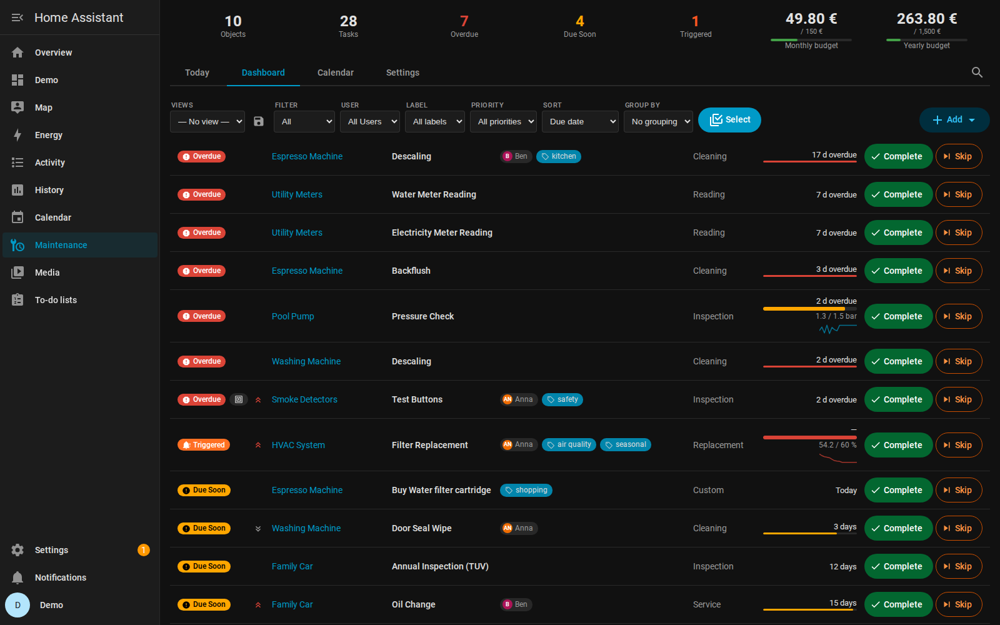
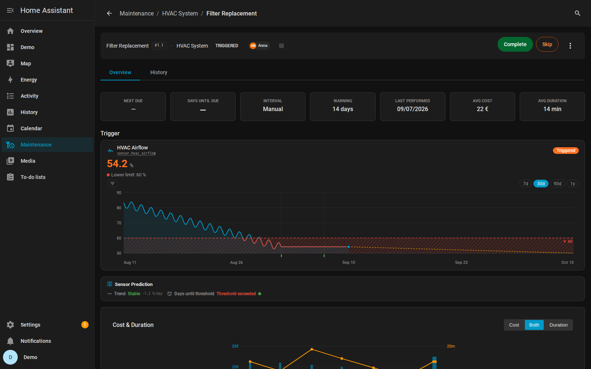
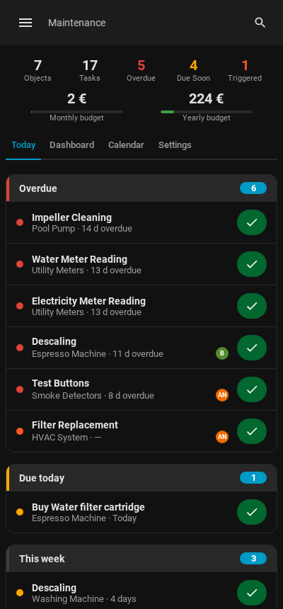
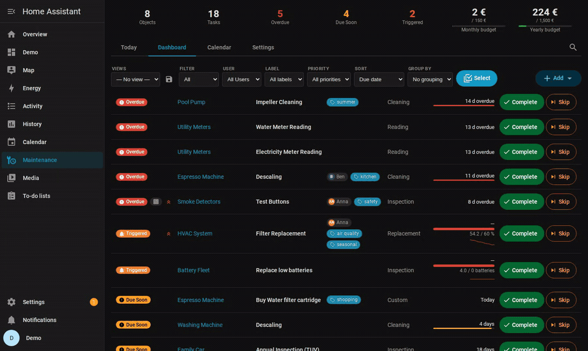

# Maintenance Supporter

[](https://github.com/hacs/default)
[](https://analytics.home-assistant.io/)
[](https://github.com/iluebbe/maintenance_supporter/releases)
[](docs/ARCHITECTURE.md#test-coverage)
[](docs/ARCHITECTURE.md#test-coverage)
[](https://community.home-assistant.io/t/custom-integration-maintenance-supporter-sensor-triggered-adaptive-maintenance-for-your-home/995556)

Everything in your home that needs regular upkeep — filters, pumps, cars,
appliances, smoke detectors — tracked in one place inside Home Assistant.
Schedule by time or by real sensor data, get reminded, check things off from
your phone, and keep the full history of what was done and what it cost.

> **Not the same as HA's built-in *Maintenance Dashboard* (2026.5+).** That
> dashboard auto-discovers low-battery devices — narrow scope, zero config.
> *Maintenance Supporter* tracks user-defined maintenance with schedules,
> sensor triggers, history, costs, and notifications. They pair well: HA's
> built-in handles batteries, this integration handles everything else.

| Dashboard | Task Detail | Mobile |
|:-:|:-:|:-:|
|  |  |  |

<sub>More screenshots in the [feature reference](docs/FEATURES.md#screenshots).</sub>

### See it in action



<sub>Pick a template, get a fully configured object with tasks — more short
clips (completing a task, filtering the calendar) in
[FEATURES.md → In action](docs/FEATURES.md#in-action).</sub>

## What can it do for you?

**"The HVAC filter is due every 3 months."**
Create the object once (or pick it from 47 ready-made templates), give it a
task with an interval — days, weeks, months, or specific patterns like *first
Saturday* or *last business day of the month*. You get a reminder before it's
due, and completing it takes one tap — optionally with notes, cost, duration,
and a photo of the work.

**"My vacuum already knows when its filter is worn."**
**Suggested setups** (Beta) discovers devices of 123 supported integrations —
vacuums, robotic mowers, printers, kitchen appliances, heating, 3D printers,
cars — and sets them up in one click with **sensor triggers pre-wired**:
percent remaining, countdowns, wear counters, usage intervals (service every
15,000 km / blades every 100 mowing-hours), appliance events (dishwasher
"salt nearly empty"), and even engine-counted runtime for devices that expose
no counters at all. Every signature is verified against the integration's
source code.

**"Service the pump after 200 hours of runtime — not by the calendar."**
Bind a task to a real sensor: accumulated runtime, a counter (e.g. odometer
kilometers), a threshold (filter airflow below 60 %), state-change cycles, or
a combination with AND/OR logic. The task triggers when the *device* says
it's time. With adaptive scheduling it even learns your real intervals from
history and suggests better ones.

**"Whose turn is it to mow the lawn?"**
Assign tasks to household members with per-user notifications — or share a
task between several people and let responsibility rotate automatically on
each completion. Non-admin users get a safe read-only panel where they can
still check things off. Tasks also appear in a native **To-do list**, so
"Assist, mark the filter change done" just works.

**"Read the utility meters at the end of every month."**
The *Reading* task type is made for recording values, and the schedule
supports *last day of the month*, *last business day* (public-holiday-aware
when HA's Workday integration is set up), and ±N-day offsets.
Attach a photo of the meter display when completing — it lands in the task's
history.

**"What did the car cost me this year?"**
Every completion records cost and duration. Budgets with alerts, per-object
cost history, a printable PDF report, and CSV/JSON export for your spreadsheet.
Warranty dates get a colour-coded chip — and an optional reminder before they
expire.

**"I'm standing at the machine — I don't want to open an app."**
Print a QR code and stick it on the device: scanning opens the task, or with
*quick-complete* records the completion in one tap. NFC tags work too. Manuals
and invoices can be attached to any object (backup-safe, deduplicated) so the
PDF is one click away from the task you're doing.

## Get started in 5 minutes

Maintenance Supporter is in the **HACS default store** — no custom repository
needed.

[](https://my.home-assistant.io/redirect/hacs_repository/?owner=iluebbe&repository=maintenance_supporter&category=Integration)

1. **Install:** open HACS, search for *"Maintenance Supporter"*, install, and
   restart Home Assistant. (Manual install: copy
   `custom_components/maintenance_supporter/` into your `config/custom_components/`.)
2. **Set up:** *Settings → Devices & Services → Add Integration →
   "Maintenance Supporter"*. The short wizard asks for your notification
   service — everything else has sensible defaults.
3. **Create your first object:** open the new **Maintenance** entry in the
   sidebar and pick **Add ▾ → From template** — choose *Car*, *HVAC*,
   *Washing machine*, *Pool*, … and get an object with typical tasks
   pre-configured. Or **Add ▾ → New object** and build your own.
4. **Done.** Tasks show up on the panel dashboard, in the calendar, in the
   To-do list, and as sensors you can automate on. When something is due,
   you'll hear about it.

Prefer talking to an assistant? A portable
[LLM setup skill](skills/maintenance-setup-assistant/) lets Claude Code /
Assist / any MCP-style agent discover your devices and create objects + tasks
for you — always previewing before it writes.

## Feature overview

| Area | What you get | Details |
|---|---|---|
| **Suggested setups** | 123 integrations / 231 verified signatures with pre-wired sensor triggers — boilers, vacuums, cars, locks, printers, purifiers and more | [Supported integrations](docs/INTEGRATIONS.md) |
| **Battery fleet** | One task for all 30–70+ batteries — grouped shopping list, discharge-trend forecast with per-battery sparklines, mark-all-replaced, spare-part stock; rechargeables are tracked for charging, never shopped. Best with [Battery Notes](https://github.com/andrew-codechimp/HA-Battery-Notes); native `device_class: battery` devices work too (degraded) | [Features → Battery Fleet](docs/FEATURES.md#battery-fleet-battery-notes-or-native) |
| **Scheduling** | Intervals (days→years), calendar patterns (weekdays, nth weekday, day of month, last/business day ±offset), one-time, manual; seasonal month windows, finite series (ends after N times / on a date), postpone a single occurrence; drift-free planned anchoring; time-of-day precision; live "next three dates" preview while editing | [Features → Task Management](docs/FEATURES.md#task-management) |
| **Sensor triggers** | Threshold, counter, runtime, state-change, compound (AND/OR), multi-entity; auto-complete on sensor recovery; adopt HA `device_class: problem` sensors as tasks | [Features → Triggers](docs/FEATURES.md#sensor-based-triggers) |
| **Adaptive scheduling** | Learns real intervals (EWA + Weibull), seasonal factors, degradation prediction, feedback loop | [Features → Adaptive](docs/FEATURES.md#adaptive-scheduling) |
| **Notifications** | Any `notify.*` target, per-user routing, actionable mobile buttons, quiet hours, bundling, lead-time reminders, weekly digest, warranty reminders, vacation mode | [Features → Notifications](docs/FEATURES.md#notifications) |
| **Household** | Priorities, labels, checklists, user assignment + rotation (whose turn it is shows on the card), operator (read-only) mode, native To-do entity | [Features → Task Management](docs/FEATURES.md#task-management) |
| **History & money** | Full history with cost/duration/photos, Missed-vs-skipped, budgets + alerts, PDF report, CSV/JSON import & export | [Features → Data Management](docs/FEATURES.md#data-management) |
| **Documents** | Attach manuals/invoices/photos per object — backup-safe, deduplicated, searchable, linkable to tasks (PDF page jump) | [Features → Documents](docs/FEATURES.md#documents--manuals-2110) |
| **Spare parts** | Parts inventory: identifiers (MPN, GTIN/EAN), storage location, stock + reorder threshold, auto “buy” tasks with shopping links, restock on completion, stock sensors. Several objects can share one stock, so identical appliances draw on one real pile | [Features → Task Management](docs/FEATURES.md#task-management) |
| **Quick actions** | QR codes (view / complete / one-tap quick-complete), NFC tags, on-complete service calls back to the device | [Features → Completion Actions](docs/FEATURES.md#completion-actions-130-advanced) |
| **Dashboards** | Sidebar panel (Today view, `/` command palette, bulk actions, saved filter views), Lovelace card, calendar card, battery-fleet card, auto-generated dashboard strategies | [Examples → Dashboards](docs/EXAMPLES.md#lovelace-card) |
| **Localization** | Full UI in 22 languages across panel, config flow, and notifications | [Features → Frontend](docs/FEATURES.md#frontend) |

## Entities & automation hooks

Each task is a **sensor** (`ok / due_soon / overdue / triggered`, plus
`paused` / `archived`) with a **binary sensor** (`device_class: problem`),
**complete/skip/reset buttons** and two opt-in companions — a **next-due
timestamp** and a numeric **days-until-due countdown** for gauge and
progress-bar cards (both disabled by default). Global **summary sensors**
count what needs attention, alongside *parts to reorder*, *batteries to
replace* and *document storage*; spare parts get their own **stock
sensors**, a **calendar** entity feeds your calendar cards, and a **to-do**
entity mirrors open work. Lifecycle **events** (`…_task_completed`,
`…_trigger_activated`, …) fire on every path, and nine **services** —
`complete` / `skip` / `reset` / `export_data` plus full task CRUD
(`add_object`, `add_task`, `update_task`, `delete_task`, `list_tasks`) —
cover scripting. Six **Assist intents** answer *"what maintenance is due?"*,
complete or snooze tasks, read out instructions and check spare-part stock
by voice — LLM-based Assist picks them up automatically; classic Assist uses
the shipped sentence files
([Features → Voice & Assist](docs/FEATURES.md#voice--assist-226)).

On HA 2026.7+ the new automation editor additionally offers ready-made
building blocks — *"A maintenance task became overdue"* as a pickable
trigger, *"…needs attention"* as a condition — so automations need neither
entity names nor YAML.

Entity IDs follow `sensor.<object>_<task>` (no shared prefix) — filter with
`integration_entities('maintenance_supporter')` in templates. Full reference
with copy-paste automations: [EXAMPLES.md](docs/EXAMPLES.md).

## Documentation

| Document | Contents |
|---|---|
| [FEATURES.md](docs/FEATURES.md) | The complete feature catalogue + screenshots + platform/entity reference |
| [CONFIGURATION.md](docs/CONFIGURATION.md) | Every configurable parameter (global, per-object, per-task, triggers) |
| [EXAMPLES.md](docs/EXAMPLES.md) | Use-case recipes, automation YAML, cards & dashboard strategies |
| [TROUBLESHOOTING.md](docs/TROUBLESHOOTING.md) | Known limitations, common issues, debug logging, uninstalling |
| [ARCHITECTURE.md](docs/ARCHITECTURE.md) | Internals: data flow, trigger engine, WebSocket API (90 commands), tests |
| [ROADMAP.md](ROADMAP.md) | What's planned and what shipped — ideas welcome via [Discussions](https://github.com/iluebbe/maintenance_supporter/discussions) |
| [CHANGELOG.md](CHANGELOG.md) | Release history |

## Requirements

- Home Assistant **2025.7.0** or newer
- One Python dependency, installed automatically by Home Assistant: `pypdf`
  (used to cut a single page out of a linked manual for the work sheet)

## Development

```bash
bash scripts/init-dev.sh     # one-command Docker dev setup (login: dev/dev at :8125)
docker exec ha-maint sh -c "cd /config && python -m pytest tests/ -q"
```

The integration tracks HA's [integration quality scale](https://developers.home-assistant.io/docs/core/integration-quality-scale/)
— currently **Silver**, with the per-rule self-assessment in
[`quality_scale.yaml`](custom_components/maintenance_supporter/quality_scale.yaml).

Details (faketime, demo data, e2e): [ARCHITECTURE.md → Development](docs/ARCHITECTURE.md#development--testing-infrastructure).

## Community

Questions, feedback, or want to share your setup? Join the
[Home Assistant Community Forum thread](https://community.home-assistant.io/t/custom-integration-maintenance-supporter-sensor-triggered-adaptive-maintenance-for-your-home/995556)
or open a [Discussion](https://github.com/iluebbe/maintenance_supporter/discussions).

## License

MIT
