# Getting started — from the first task to the full toolbox

This guide walks you through Maintenance Supporter in the order most people
need it: **each level builds on the one before**, and you can stop at any
level — everything below it already works on its own. Nothing here needs YAML.

| Level | You get | Time |
|---|---|---|
| [1 — Your first maintenance task](#level-1--your-first-maintenance-task) | Objects, tasks, due dates, one-tap completion | 5 min |
| [2 — Never miss a date](#level-2--never-miss-a-date) | Notifications, calendar, To-do list, Today view | 10 min |
| [3 — Let your devices tell you](#level-3--let-your-devices-tell-you) | Sensor triggers, suggested setups, counter resets, battery fleet | 15 min |
| [4 — Share the chores](#level-4--share-the-chores) | Users, rotation, QR codes and NFC tags at the device | 15 min |
| [5 — Parts, documents and money](#level-5--parts-documents-and-money) | Spare parts, shopping list, manuals, costs, reports, areas | 20 min |
| [6 — Fine-tune the schedule](#level-6--fine-tune-the-schedule) | Calendar patterns, seasons, adaptive intervals, required details | as needed |
| [7 — Automate everything](#level-7--automate-everything) | Completion actions, events, automations, voice, dashboards | as needed |

The complete reference is [FEATURES.md](FEATURES.md); every setting is in
[CONFIGURATION.md](CONFIGURATION.md).

---

## Level 1 — Your first maintenance task

**Install.** Maintenance Supporter is in the HACS default store: HACS →
search *Maintenance Supporter* → install → restart Home Assistant. Then
*Settings → Devices & services → Add integration → Maintenance Supporter*.
The short wizard asks whether to send notifications and where — you can
leave that off for now and come back in level 2.

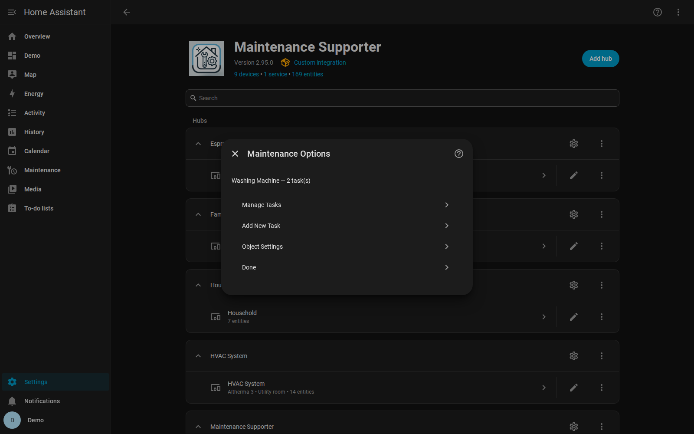

**Your first object.** Open **Maintenance** in the sidebar and choose
**Add ▾ → From template**. Pick something you own — *Car*, *Heating*,
*Washing machine*, *Smoke detectors* … (96 templates in 10 categories). The
gallery opens with *Recommended for your home*: what your home type, climate
and region call for. The object arrives with its typical tasks and sensible
intervals, all editable. (Where a template mentions legal duties or
intervals, that is guidance, not legal advice — local rules and the
manufacturer's instructions take precedence.)

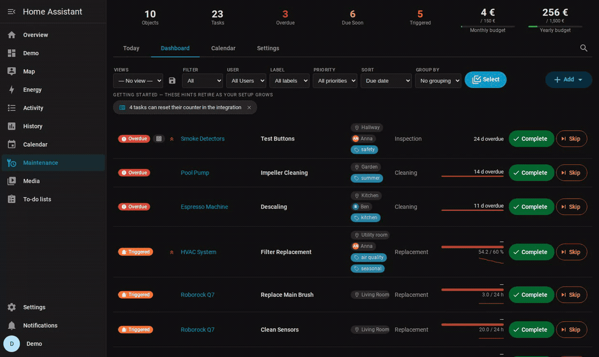

No template fits? **Add ▾ → New object**, then add tasks with a name and an
interval (every 3 months, every year …).

**The dashboard.** Every task shows its status — *OK*, *Due soon*,
*Overdue* — and how far it is from being due. Sort, filter and group it;
the numbers on top are the counts per status.

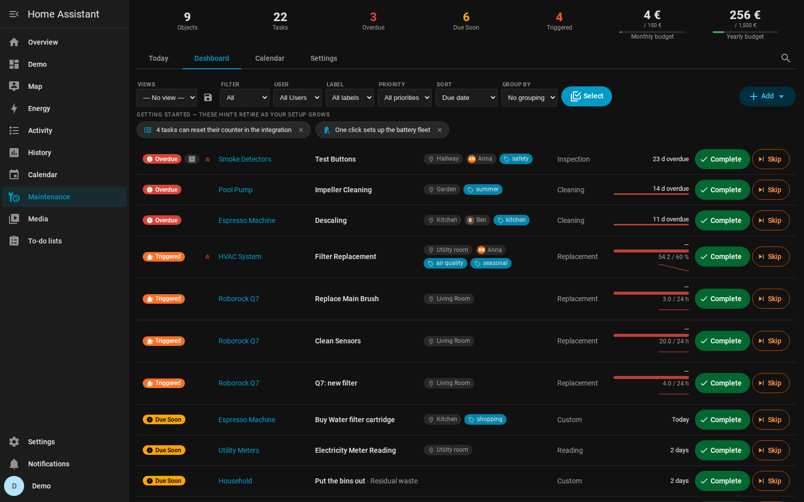

**Complete a task.** Press **Complete** on the row — that's it. The dialog
lets you add notes, cost, duration and a photo if you want to; the next due
date is calculated from the completion.

Each task keeps its **history**: who did what, when, at what cost.

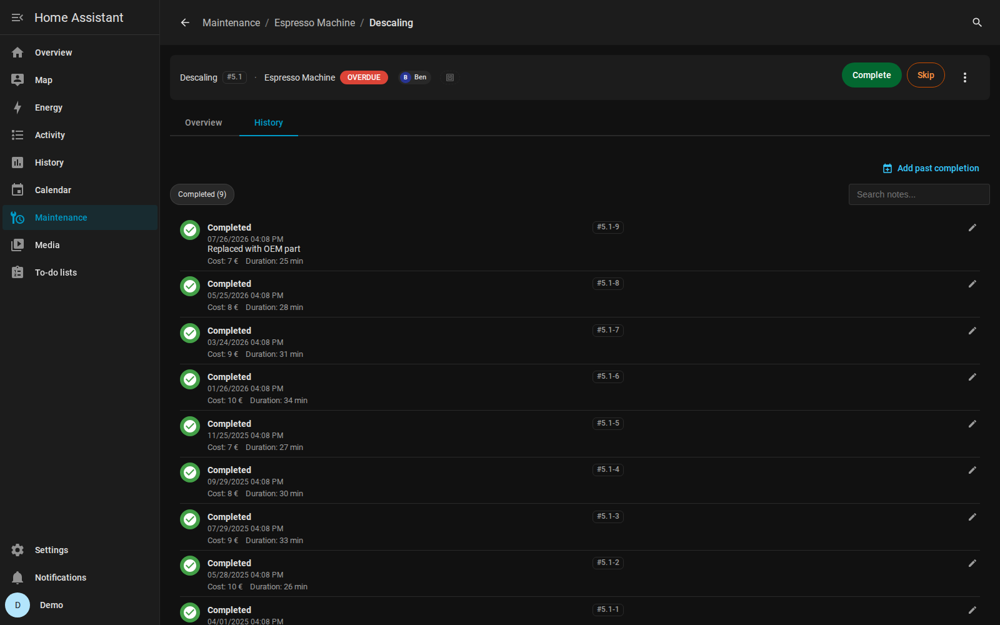

> **Good to know:** a task's name, interval and warning period can be changed
> any time (open the task → edit). Its history is never touched by that.

---

## Level 2 — Never miss a date

**Notifications.** They are off until you switch them on: in the panel,
*Settings → General → Notifications*, then pick where reminders go — the
Companion app on your phone, any `notify.*` service or notify entity. *Send
test* checks it, and *Per-person delivery* right below shows where each
household member's reminders end up (level 4). You get a reminder when a
task is due soon, when it is overdue and when a sensor triggers it
(level 3). The *Notifications* section that now appears has *Mobile Action
Buttons*: switch them on and the phone notification gets **Complete**,
**Skip** and **Snooze** buttons — done without opening the app (Companion
app only).

Useful extras in that section: quiet hours, a weekly digest and bundling
several reminders into one. Going away? *Settings → Vacation mode* pauses
the reminders while you're gone.

**Today view.** The *Today* tab shows only what needs you soon, in three
sections: *Overdue* (including what a sensor triggered), *Due today* and
*This week* — the next seven days.

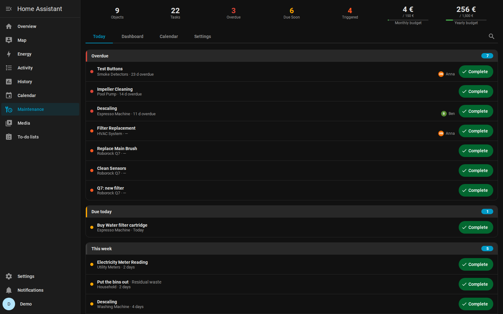

**Calendar and To-do list.** Every task is also an event in the
Maintenance calendar (panel tab *Calendar* and a `calendar.` entity for your
dashboards) and an item in a native **To-do list** — check it off there and
the task is completed.

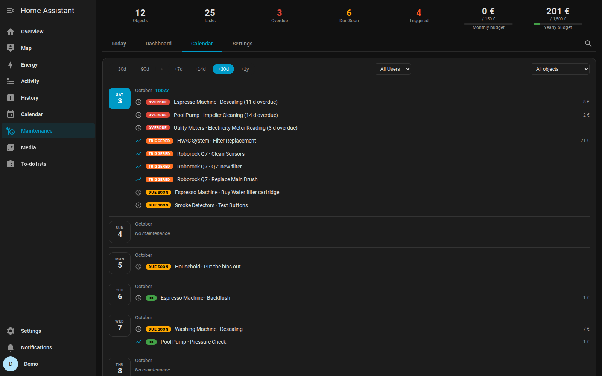

> **Good to know:** each task is also a sensor (`sensor.<object>_<task>`)
> with its status, next due date and days until due — ready for your own
> dashboards and automations (level 7).

---

## Level 3 — Let your devices tell you

Calendars are a guess; your devices know better. From here on, tasks fall
due when **a sensor says so**.

**Suggested setups — one click for devices you already have.** Panel →
**Add ▾ → Suggested setups** looks through your Home Assistant devices for
the 225 integrations it knows — robot vacuums, mowers, printers, heating,
water softeners, cars, wallboxes, purifiers … — and proposes their
maintenance with the sensors **already wired**: "replace the filter when it
is below 10 %", "clean the brush every 30 hours of cleaning". Tick what you
want and press *Set up selected*.

Where the device counts a consumable itself (robot vacuums, mowers, litter
boxes, ventilation units), completing the task here also **presses the
device's own reset button**, so its counter starts again at full life — the
suggestion says so on each line. Tasks you set up before this existed are
offered the same in the dialog.

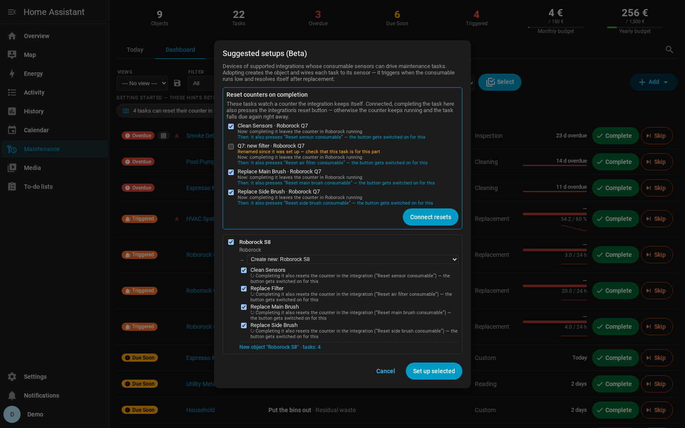

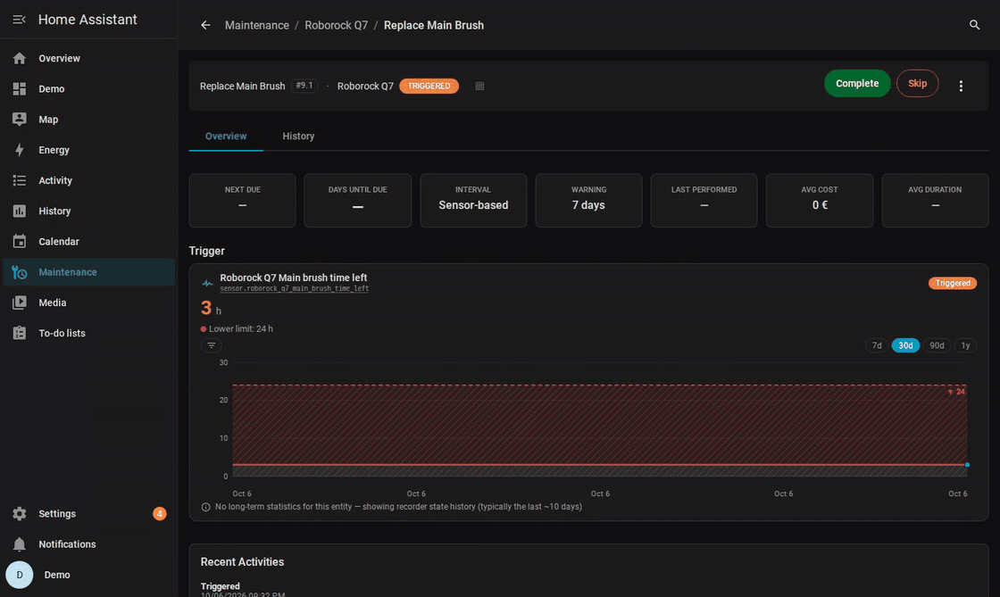

**Your own sensor trigger.** Any task can watch a sensor instead of (or in
addition to) the calendar: *below / above a value* (filter airflow below
60 %), *a counter* (every 15,000 km), *runtime* (every 200 pump hours), *a
state change* (every 30 wash cycles), *a due date the device reports
itself* (a purifier's *Filter change due*: the task falls due that day, or
a few days before), several sensors at once, or AND/OR combinations. The
task detail shows why it is due, with the live reading and its history.

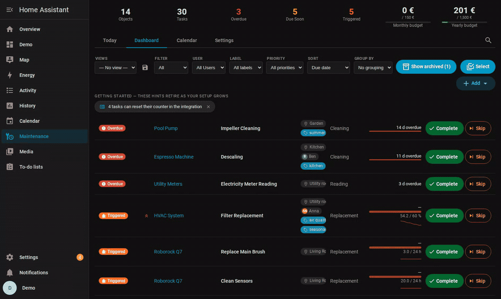

**Problem sensors.** Many devices already report problems (*filter clogged*,
*low salt*, *leak*). **Add ▾ → Adopt problem sensors** turns them into tasks
that resolve themselves when the problem clears.

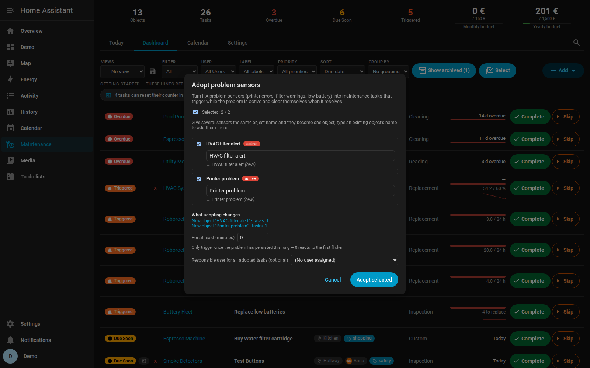

**Batteries.** One task for every battery in the house: the **battery fleet**
lists each one with its level, a discharge trend and a predicted replacement
date, and groups the shopping list by battery type. **Add ▾ → Battery
fleet** sets it up once your devices report batteries; it works best with
[Battery Notes](https://github.com/andrew-codechimp/HA-Battery-Notes).

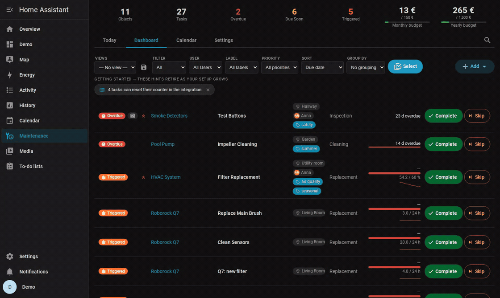

---

## Level 4 — Share the chores

**Who does it?** Assign a task to a person (any Home Assistant user). Their
avatar shows on the row, and reminders can go to that person only. Share a
task between several people and let it **rotate** on every completion —
whose turn it is shows on the card.

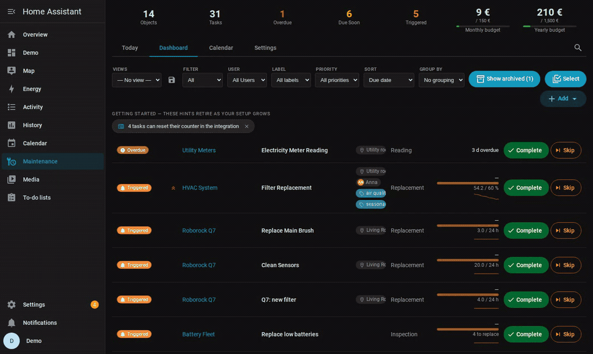

People who are not administrators see the panel read-only, but can still
complete, skip, reset, postpone and snooze tasks. If some of them should
also create and edit objects and tasks, allow it for exactly those people in
*Settings → Panel access*.

**At the device: QR codes.** Every task has a QR code (task → ⋮ → *QR code*;
all at once in *Settings → Print QR codes*): *View maintenance info* opens
the task, *Mark maintenance as complete* opens the complete dialog. With
*Settings → Advanced Features → Completion actions* switched on, a task can
get *quick-complete defaults* (notes, cost, duration) — and with them a
third, lightning-bolt code, *Quick-complete — no dialog*, that records the
completion in one scan.

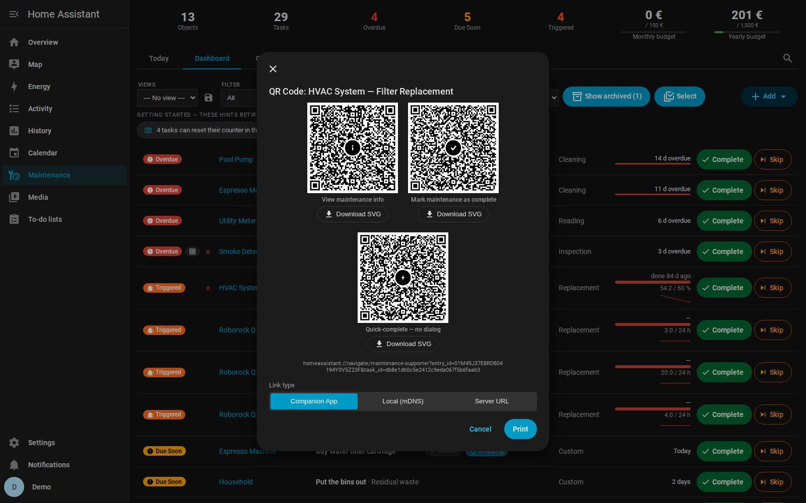

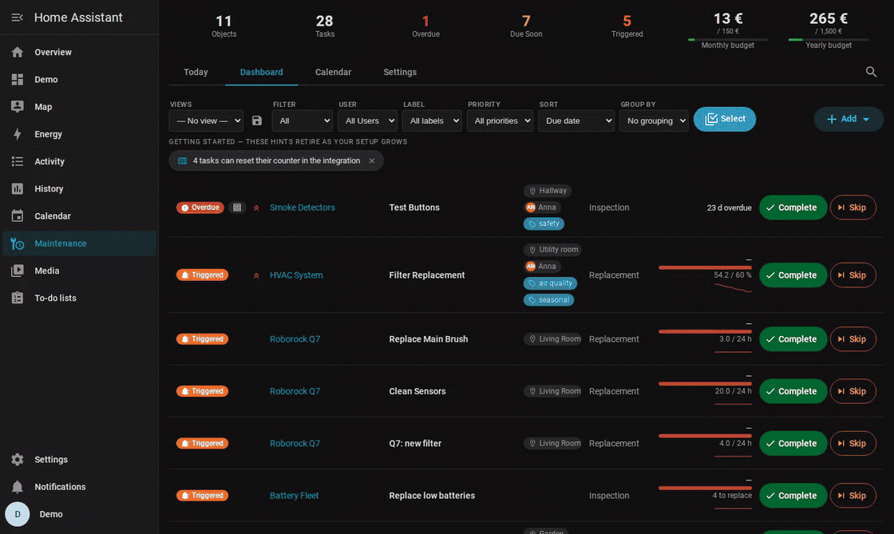

**Proof of presence.** Stick an NFC tag on the smoke detector and switch on
*Only complete by scanning the tag* in the task: it can then only be
completed at the detector itself.

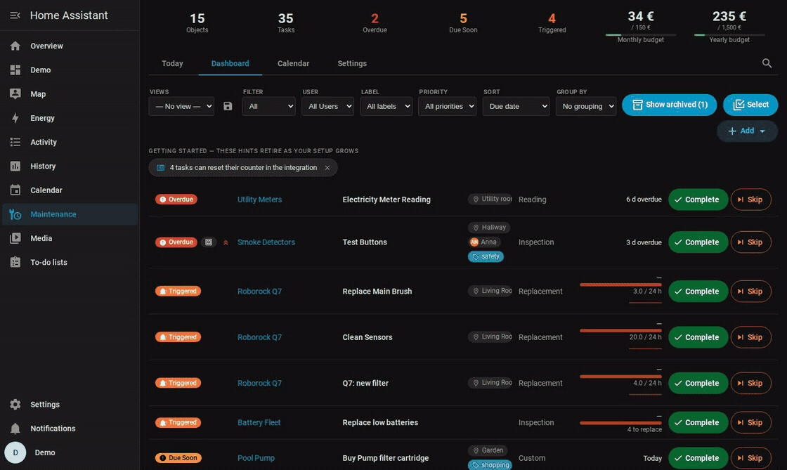

---

## Level 5 — Parts, documents and money

**Spare parts.** Give an object its parts — filters, brushes, descaler — with
part number, storage place and stock; a part you buy in packages (a 25 kg
bag of salt, a 400 ml can) keeps its stock in the unit a job uses. A task
can consume them on completion; when the stock drops to the reorder
threshold, a *"Buy …"* reminder appears on its own. Pick a list in
*Settings → General → Shopping list (buy tasks)* and the reminder also lands
on that Home Assistant shopping list — check it off at the store and the
part is restocked.

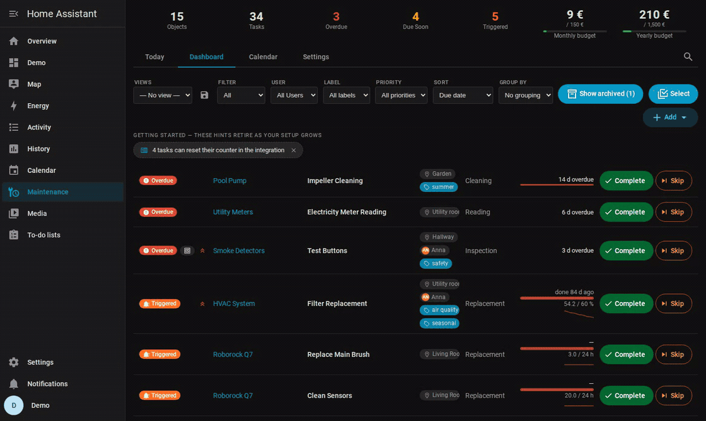

**Manuals and invoices.** Attach PDFs, photos and links to an object — or to a
task, with the page of the manual that describes it. They are part of your
Home Assistant backup, and the search finds words **inside** the PDFs.

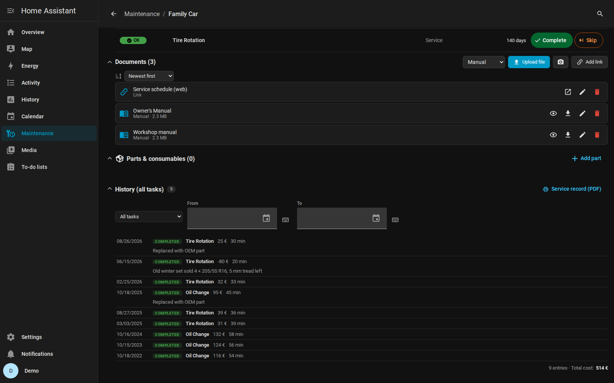

**Costs and budgets.** Every completion can record its cost, and spare parts
count too — *Settings → General → Spare parts count as spending* decides
whether a part counts when it is bought or when a job uses it. Switch on
*Settings → Advanced Features → Budget Tracking* for monthly and yearly
budgets with alerts.

**Reports.** Every object has a printable **maintenance report** (object →
⋮) and a **service record** of everything done — print it or save it as PDF,
e.g. when you sell the car.

> **Good to know:** when a machine dies, object → ⋮ → *Replace…* retires it
> with its history and costs and creates the new unit. If the new one is
> another Home Assistant device, its sensor triggers, completion actions and
> counter reset move to that device.

**Areas.** *All objects → All areas* shows every Home Assistant area with its
costs — this year and in total — and one area's merged history, cost per
month and cost per object, with an **area report** for the yearly overview of
the whole flat or house. Each area also gets a sensor,
`sensor.<area>_maintenance_cost`, placed in that area: it shows up on the
area's dashboard, and a *statistics graph* card with period *year* shows
what a room cost per year.

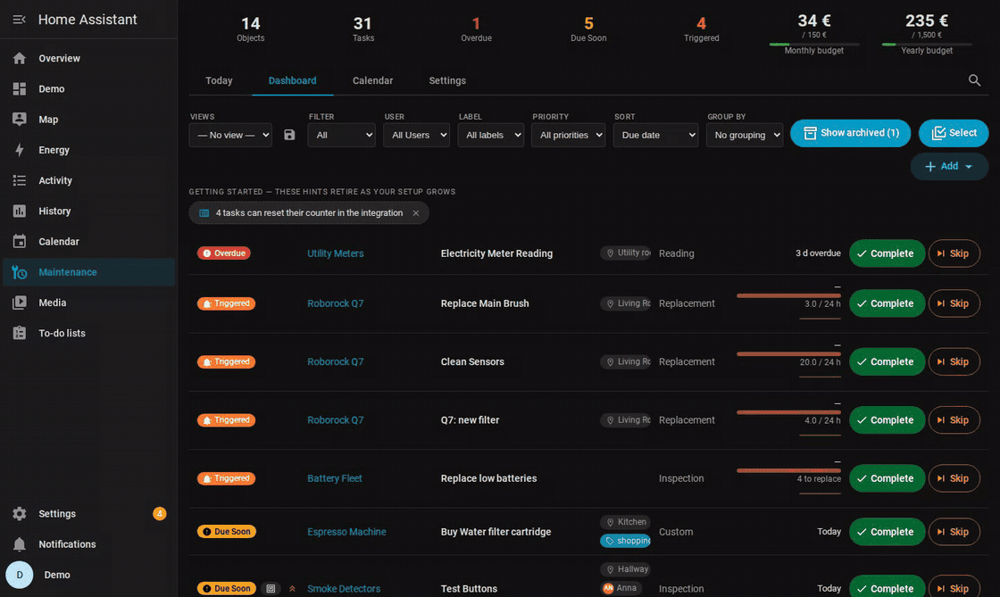

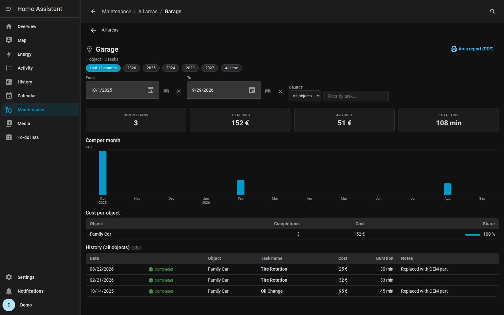

---

## Level 6 — Fine-tune the schedule

**Calendar patterns.** Not every duty is "every N days": *first Saturday of
the month*, *last business day*, *every 15 October*, a **season** (mow every
week from April to October), a finite series (5 times), or the events of a
Home Assistant calendar (put the bins out the evening before collection).
The task dialog previews the next dates while you edit.

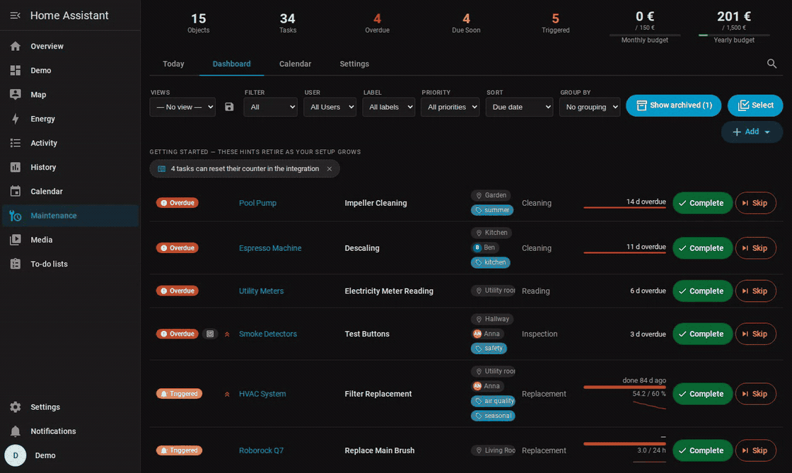

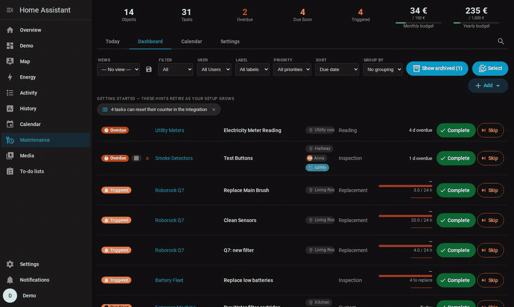

**Postpone once, pause for the season.** A single occurrence can be moved
without changing the rhythm; a whole object (pool, mower) can be paused over
winter, or just one of its tasks (task → ⋮ → *Pause…*, optionally until a
date — the filter of a purifier you put away for the summer). Either
resumes with a fresh cycle.

**Alternating work.** One task, one rhythm, different work each time — *flip,
flip, replace* for the mower blades — with *cycle phases*.

**Readings.** A *Reading* task records values (water, electricity, gas) —
several meters in one task, each with its delta in the history.

**Required details.** A task can demand details before it counts as done —
a note, a cost, the duration, a photo or who did it.

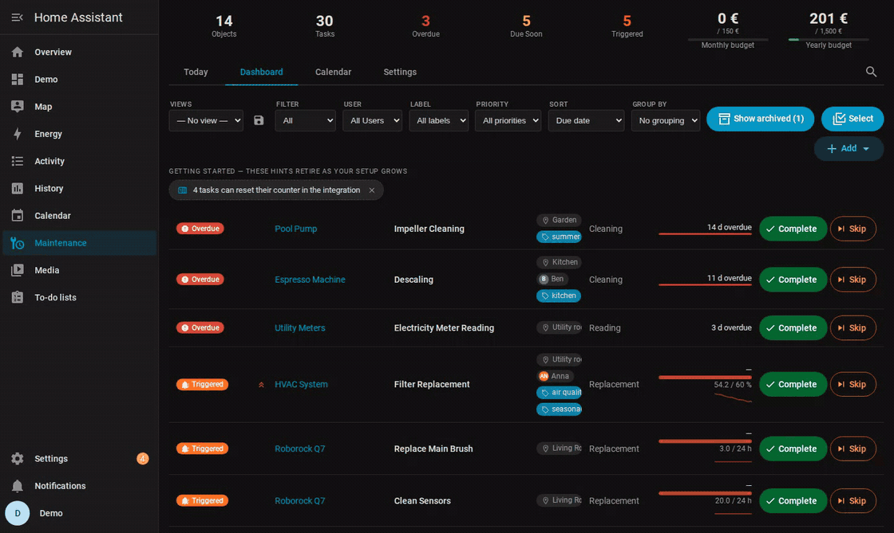

**Adaptive intervals.** Switch on *Settings → Advanced Features →
Adaptive Scheduling*: the integration learns how often a task really needs doing from
your completions (and the sensor data) and suggests a better interval; with
*Seasonal Adjustments* switched on as well it adjusts it through the year.
You always confirm.

---

## Level 7 — Automate everything

**Completion actions.** Switch on *Settings → Advanced Features → Completion
actions*:
a task can run any Home Assistant action when it is completed — turn the
pool pump back on after cleaning it, reset a helper counter. (Counter resets
from suggested setups use the same mechanism.)

**Events and automations.** Every completion, skip and reset fires an event
with the details (`maintenance_supporter_task_completed` …); Home Assistant
2026.7+ also offers maintenance triggers and conditions directly in the
automation editor. Your own notification rule, as Developer tools sees it:

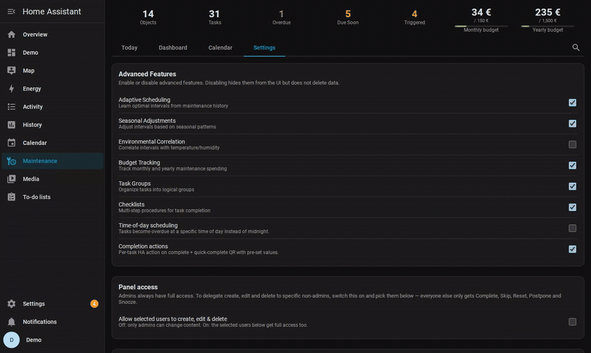

Copy-paste recipes: [EXAMPLES.md](EXAMPLES.md).

**Voice.** Turn on *Settings → General → Install Assist sentences* and ask
Assist *"What maintenance is due?"* or say *"Mark the filter change done"*.
The household sentences add *"What do we need to buy?"*, *"Whose turn is it
for the filter change?"* and *"Undo that"*, which takes back your own last
action. All of them: [FEATURES → Voice & Assist](FEATURES.md#voice--assist-226).

**Dashboards.** Put a maintenance card, the calendar card, the battery-fleet
card — or the whole panel — on any dashboard, or let the dashboard strategy
generate a complete maintenance dashboard.

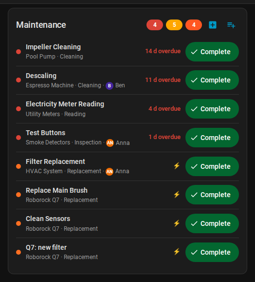

---

## Where to go next

- Everything in detail, with more screenshots: [FEATURES.md](FEATURES.md)
- Every setting: [CONFIGURATION.md](CONFIGURATION.md)
- Moving to a new Home Assistant: [FEATURES → Moving to another Home Assistant](FEATURES.md#moving-to-another-home-assistant-296)
- Recipes and automations: [EXAMPLES.md](EXAMPLES.md)
- Which devices Suggested setups knows: [INTEGRATIONS.md](INTEGRATIONS.md)
- Something not working: [TROUBLESHOOTING.md](TROUBLESHOOTING.md)
- Questions and ideas: [GitHub Discussions](https://github.com/iluebbe/maintenance_supporter/discussions)
